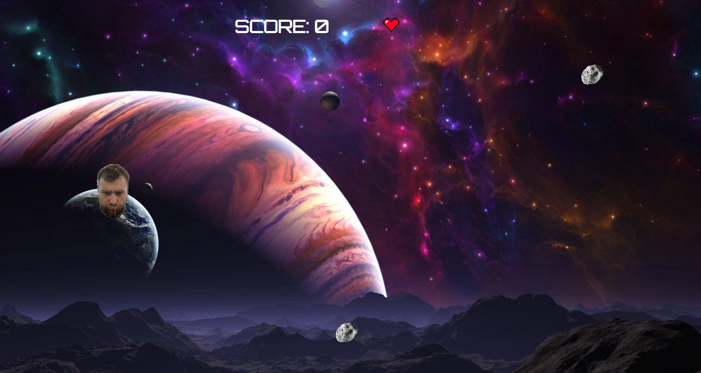

# Asteroid crusher

## About the game

This is the game about space and saving the mankind from asteroids.

## Instructions

The goal of the game is to destroy as many asteroids as possible without missing as less as you can.

The earth can only take 3 hits of an asteroid, after that game will be over.

After certain amount of time asteroids start to move faster.

Lives are displayed at the top middle of the screen.

## Controls

There are 3 main controls in the game:

+ move player up;
+ move player down;
+ click on the play button of the start game screen to play with music;

## Link to a game DEMO

https://serhiikvasha.github.io/project1-game/

